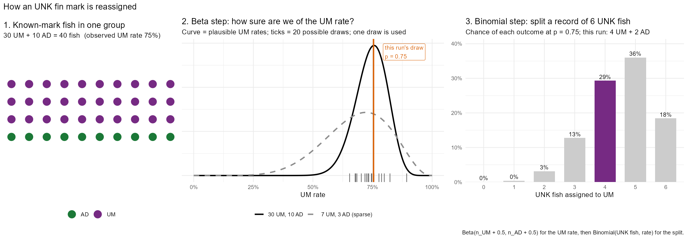

# Unknown fin mark (UNK) reassignment

Optional pre-processing step in `template_scripts/fw_creel.Rmd` that assigns sampled fish with an unknown fin mark (UNK) to adipose-clipped (AD) or unmarked (UM) before effort and catch estimation.

## Files

| File | Purpose |
|---|---|
| `R_functions/reassign_unk_marks.R` | Reassigns UNK fish to AD/UM |
| `R_functions/summarise_unk_reassignment.R` | Reconciliation and bounds table |
| `R_functions/plot_unk_mark_reassignment.R` | Mark rate and sample size figures by time and section |
| `tests/test-reassign_unk_marks.R` | Tests (synthetic data only) |
| `documentation_files/unk_beta_binomial_example.R` | Regenerates the worked-example figure in this README |

## Usage

Set the report parameters in the YAML header of `fw_creel.Rmd`:

| Parameter | Default | Description |
|---|---|---|
| `unk_mark_reassign` | `"none"` | `"none"` or `"binomial"` |
| `unk_mark_species` | `""` | Species to reassign, e.g. `"Coho"`; `""` = all species |
| `unk_mark_min_known` | `10` | Interviews with known-mark fish a group needs before its mark rate is used |
| `unk_mark_window_weeks` | `1` | Weeks on either side pooled when a single week is too sparse |
| `unk_mark_kept_as_ad` | `FALSE` | `TRUE` for mark-selective fisheries: kept UNK fish are AD by regulation |
| `unk_mark_seed` | `1` | Random seed; change to produce an alternate reassignment |

Run the tests from the project root:

```r
testthat::test_file(here::here("tests", "test-reassign_unk_marks.R"))
```

## Methods

### Purpose

Some sampled fish are recorded with an unknown fin mark (UNK) because the adipose fin was not checked. Leaving them out would under-count marked (AD) and unmarked (UM) catch groups. Before estimating effort and catch, each UNK fish is assigned to AD or UM based on the mark rate of fish whose mark was recorded.

### Steps

1. **Select the fish.** Only fish recorded as UNK, for the species chosen in the report parameters, are reassigned. Fish with a known mark are not changed.
2. **Group similar fish.** A mark rate is always calculated within the same species and fate (kept or released), and where possible within the same life stage, section, and week.
3. **Require enough data.** A group's mark rate is used only if at least 10 interviews in that group recorded known-mark fish. Interviews are counted instead of fish because fish from the same angler group are not independent.
4. **Fall back when data are sparse.** If a group does not have enough data, the next broader group is tried, in this order:
   1. Same section and week
   2. Same week, all sections
   3. Same week plus the week before and after, all sections
   4. Whole season, same life stage
   5. Whole season, all life stages

   UNK fish that still do not have enough data stay UNK and are reported.
5. **Estimate the mark rate (beta step).** See [The beta-binomial approach](#the-beta-binomial-approach).
6. **Split the UNK fish (binomial step).** Each UNK record is split into UM and AD fish by a random draw using the group's mark rate. For example, a record of 6 UNK fish with a UM rate of 0.75 might become 4 UM and 2 AD.
7. **Optional rule for kept fish.** In mark-selective fisheries, kept UNK fish can be assigned to AD by regulation instead of by a mark rate.
8. **Check and report.**
   - **Totals:** the number of fish within each species, life stage, and fate must be unchanged; the code stops if it is not.
   - **Audit trail:** every reassigned record keeps its original mark (`fin_mark_raw`), the group used (`unk_stratum`, `unk_rate_level`), and the rate drawn (`unk_p_um`).
   - **Table:** shows how UNK fish were split, and the AD share if all UNK were UM or all were AD.
   - **Figures:** show observed and reassigned mark rates, with sample sizes, by week and section.

### The beta-binomial approach

The method estimates one mark rate per group with a **beta distribution**, then splits UNK fish with a **binomial** draw. It is not a regression: there are no predictors, only one rate per group.

**Beta step: how sure are we about the mark rate?**

- Count the known-mark fish in the group: $n_{UM}$ unmarked and $n_{AD}$ marked.
- The unmarked rate is described by a beta distribution:

$$
p_{UM} \sim \text{Beta}(n_{UM} + 0.5,\; n_{AD} + 0.5)
$$

- The "+0.5" on each side is a standard, minimally informative starting point (the Jeffreys prior). It keeps a small group, such as 10 AD and 0 UM, from implying a 0% UM rate with complete certainty.
- The distribution centres on the observed rate, and its spread shows how much data there is:

| Known-mark fish | Distribution | Average UM rate | Plausible range |
|---|---|---|---|
| 30 UM, 10 AD | Beta(30.5, 10.5) | about 0.74 | about 0.60–0.86 |
| 7 UM, 3 AD | Beta(7.5, 3.5) | about 0.68 | about 0.39–0.91 |

- One rate is drawn at random from this distribution for each group. Every UNK record in the group uses that same draw.

**Binomial step: how many UNK fish become UM?**

For a record of $k$ UNK fish:

$$
\text{UM fish} \sim \text{Binomial}(k,\; p_{UM}), \qquad \text{AD fish} = k - \text{UM fish}
$$

Counts stay whole numbers, so the reassigned data go straight into the existing PE and BSS estimation.

**Why this approach:** the beta distribution is the standard model for an uncertain proportion. It gives wider uncertainty to groups with less data, and it is simple to calculate. The random seed is fixed, so results can be reproduced.

**In one sentence:** we use the known-mark fish to decide how likely an UNK fish is to be UM, allow for some uncertainty in that rate, then flip a weighted coin for each UNK fish.

### Worked example



**Situation:** in one group (Coho, released, adult, Section 2, week of Sept 14), anglers reported 40 fish with a known mark: 30 UM and 10 AD. One angler group also reported 6 fish with an unknown mark (UNK).

**Panel 1 – Known fish.** The observed UM rate is 30 of 40, or 75%. That is the best guess for the UNK fish too, but it comes from only 40 fish, so the true rate could be somewhat higher or lower.

**Panel 2 – Beta step: how sure are we of that 75%?**

- **The curve:** the solid curve, Beta(30.5, 10.5), shows which UM rates are plausible given 30 UM and 10 AD. It peaks near 74%, and the true rate is very likely between about 60% and 86%.
- **Less data, wider curve:** the dashed curve is a sparse group with 7 UM and 3 AD, the same share of UM. It is much wider, about 39% to 91%, because 10 fish tell us much less than 40.
- **The draw:** the code picks one rate at random from the curve. The grey ticks are 20 possible picks. This run picked **75%** (orange line).

Drawing a rate, instead of always using exactly 75%, lets the reassignment reflect that the rate itself is uncertain. Picks near the peak are the most common.

**Panel 3 – Binomial step: split the 6 UNK fish.**

- **Coin flips:** each of the 6 fish is treated like a weighted coin flip that lands UM 75% of the time.
- **Possible outcomes:** the bars show how likely each result is. 5 UM is most likely (36%), then 4 UM (29%) and 6 UM (18%), while 0–2 UM is rare.
- **This run:** the flips gave **4 UM and 2 AD**, so the record of 6 UNK fish becomes one record of 4 UM and one of 2 AD.
- **Totals:** the fish total never changes (6 in, 6 out), and counts stay whole numbers.

The figure's seed was chosen to show a typical outcome. Regenerate it with `source("documentation_files/unk_beta_binomial_example.R")`.

### Common questions

- **Why not round 75% of 6 = 4.5?** Fish have to be whole numbers, and always rounding the same way would add a small bias. Random draws average out correctly over many records.
- **Will I get the same answer if I run it again?** Yes. The seed (`unk_mark_seed`) is fixed, so a report reproduces exactly. Changing the seed gives a different but equally valid split.
- **What does one draw represent?** It is one plausible version of the truth, not the only one. That is why the report states that intervals do not include mark-rate uncertainty.
- **Is this a logistic regression?** No. Both treat known-mark fish as binomial data, but this method estimates a separate rate for each group, with no predictors. A logistic regression would model the rate from effects such as week and section, which lets sparse groups borrow strength from the rest of the data. That is a possible future improvement.

### Assumptions

1. **UNK fish are like known fish in the same group.** Within a group, UNK fish have the same mark rate as fish whose mark was recorded. This matters most for released fish, which may go unchecked for reasons related to their mark.
2. **Mark rate differs by fate.** Kept and released fish are never pooled. In mark-selective fisheries they differ by regulation. In non-selective fisheries they may still differ (voluntary release, fish size, bag limits), and keeping them separate costs some precision but does not bias the results.
3. **Marks are recorded correctly.** Fish recorded as AD or UM are assumed correct.
4. **Mark rate is stable within the group used.** Where a sparse week falls back to neighbouring weeks or the whole season, the mark rate is assumed not to change much over that period.
5. **Sampled interviews represent the fishery** within each section and time period.
6. **Fish are treated as independent when estimating the rate.** The sample-size rule counts interviews, but the rate itself is based on fish counts, so precision may be slightly overstated when groups catch several fish.
7. **Single imputation.** UNK fish are reassigned once and then treated as observed, so effort and catch intervals do not include uncertainty in the mark rate. The bounds table shows how much the results could move.
8. **Scope.** Rates use all fetched data for the fishery, not only the estimation dates. Fish with a blank mark field are not treated as UNK and are not changed.

## Implementation notes

- **Run once.** Reassigning data that were already reassigned is an error. When working interactively, re-run the `dwg_fetch` and `manual_edits` chunks before re-running the reassignment chunk.
- **Catch group definitions change meaning.** A catch group defined with `fin_mark = "UM|UNK"` previously included all UNK fish; after reassignment it includes only the UNK fish assigned to UM, and AD groups gain fish.
- **Knitr cache.** Downstream chunks depend on `dwg_fetch` and the parameter hash only. After changing the reassignment code or manual edits with `enable_cache: TRUE`, clear the `.cache` folder.
- **Weeks start on Monday** and may not match the PE or BSS time strata.
- **Check fallback use** with `count(filter(unk_marks$catch, mark_imputed), unk_rate_level, wt = fish_count)`.
